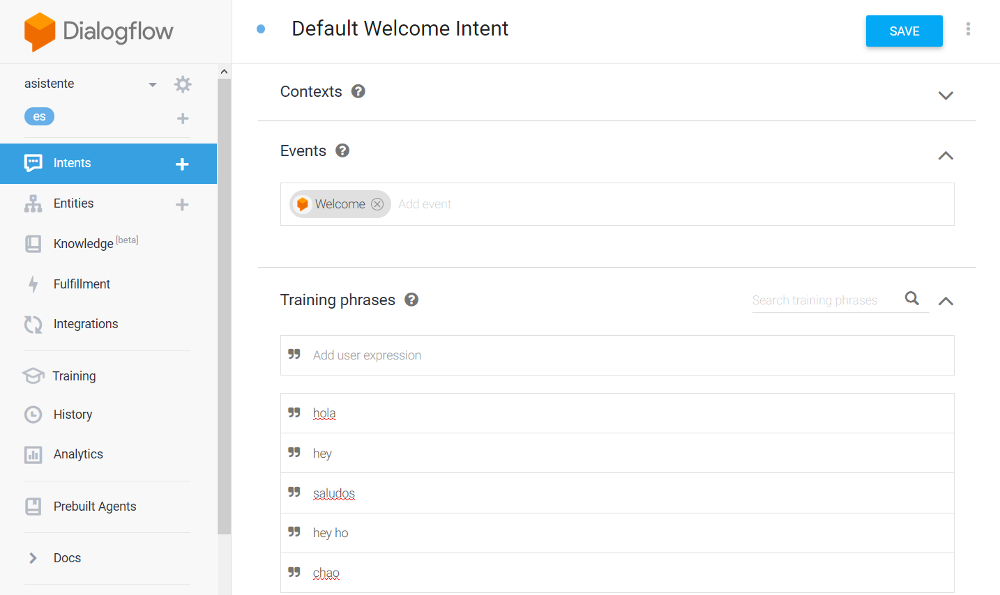
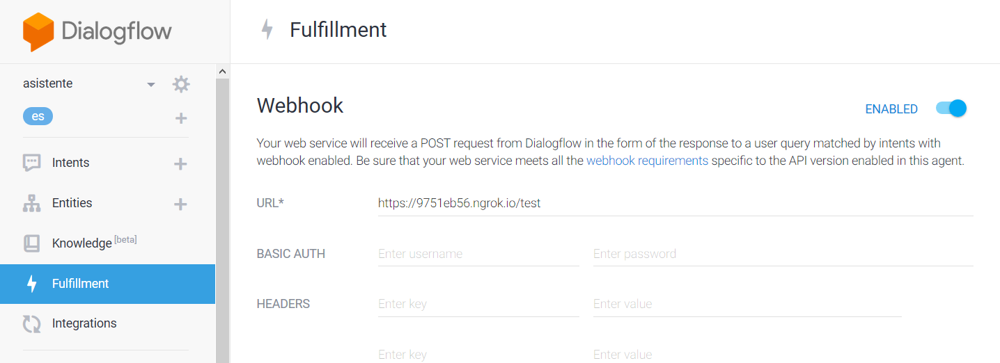
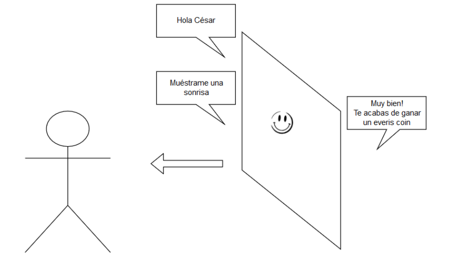

# Voice Assistant
In this repository I show two ways of develop an interactive voice assitant or in other words a chat bot.

### 1. DialogFlow
One easy way to build an interactive voice assistant is to use visual platforms such as DialogFlow. The advantage of using these platforms lies in its simplicity to fast prototyping from dialog construction to deployment to several other platforms. Furthermore, connecting to your own web service to take more control over the interaction is as easy as to paste the url endpoint in `Fullfilment` section and that's it.

First create intents in `Intents` section as show in the following picture:

Then in `Fullfilment` section add the webservice endpoint:

And this call our own webservice [dialogflow_assistant.py](https://github.com/jwilliamn/voice-assistant/blob/master/dialogflow_assistant.py)

### 2. From scratch
In some cases we need the interaction goes only one way without user voice feedback i.e. when an assistant wants to remind you things based on user's actions captuerd by a camera or another iot sensor. 

Here we build an assistant that challenges a person when is in front of a camera and recognizes him/her. The camera is connected to a facial recognition and emotion detection. The challenge is about to ask the person about several facial expression (emotion) and when is detected by the model, the assistant rewards the person.

In order to achive this, we first build the logic of the person when is in front of the camera, all details are here [interactive_client.py](https://github.com/jwilliamn/voice-assistant/blob/master/interactive_client.py)

And to start the interaction we connect to a web service, see details here [Interactive_assistant.py](https://github.com/jwilliamn/voice-assistant/blob/master/Interactive_assistant.py)